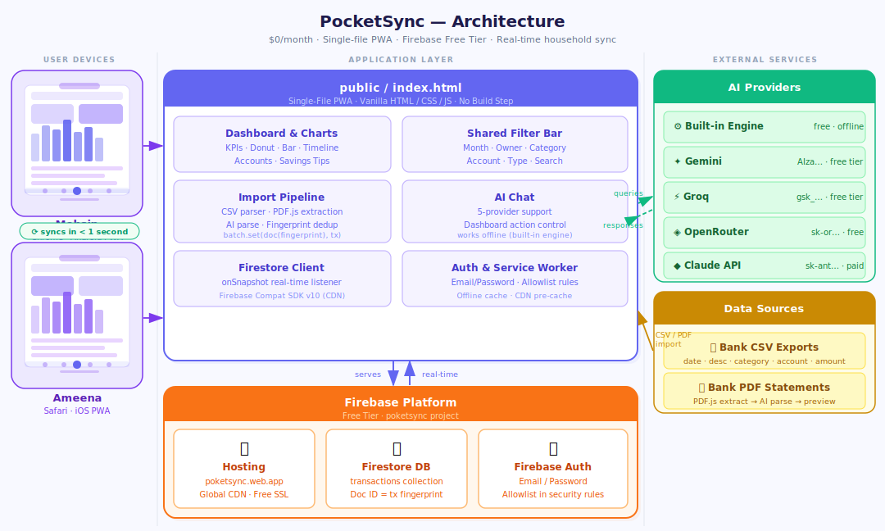

# PocketSync

A $0/month household finance tracker — a Progressive Web App that syncs in real-time across all household members' phones. No app store, no subscription, no build step.

---

## Architecture



### How it works

| Step | What happens |
|---|---|
| 1 · Load | Both phones open `poketsync.web.app` — Firebase Hosting serves `index.html` |
| 2 · Auth | Firebase Email/Password verifies each member against the allowlist in `firestore.rules` |
| 3 · Sync | `onSnapshot` listener fires immediately — both phones show the same data in < 1 second |
| 4 · Import | CSV or PDF dropped in → parsed → each row fingerprinted (`date·account·amount·desc`) → duplicates skipped → `batch.set(doc(fingerprint), tx)` written to Firestore |
| 5 · AI Chat | Questions sent to the chosen provider (or answered offline by the built-in engine) → response can trigger dashboard actions (switch tab, apply filter, highlight row) |
| 6 · Offline | Writes attempted while offline go to a localStorage queue → flushed automatically on reconnect |

---

## Stack

| Layer | Technology | Why |
|---|---|---|
| App | Vanilla HTML/CSS/JS (single file) | No build step — deployable anywhere |
| Database | Firebase Firestore | Real-time sync, free tier, offline support |
| Auth | Firebase Email/Password | Simple, no OAuth complexity |
| Hosting | Firebase Hosting | Global CDN, free SSL, $0/month |
| Charts | Chart.js 4.4.1 (CDN) | Stable, no alternative |
| PDF parsing | PDF.js 3.11.174 (CDN) | Client-side — no server needed |
| AI | Built-in + 4 external providers | Works offline; upgrade with any API key |
| Offline | Service Worker + localStorage queue | App shell cached; writes queued when offline |
| Mobile | History API + Touch events + Vibration API | Back button, swipe navigation, haptic feedback |

---

## Project Structure

```
PocketSync/
├── public/                    ← Firebase Hosting root
│   ├── index.html             ← THE ENTIRE APP (single-file PWA)
│   ├── manifest.json          ← PWA install manifest
│   ├── sw.js                  ← Service worker (offline + CDN cache)
│   ├── mobile_mockup.html     ← Visual design reference (8 screens)
│   └── icons/
│       ├── icon.svg           ← App icon (vector, any size)
│       ├── icon-192.png       ← PWA install icon
│       ├── icon-512.png       ← PWA splash / maskable icon
│       └── icon-180.png       ← iOS home screen icon
├── standalone/
│   └── finance_dashboard.html ← Desktop-only reference (no Firebase)
├── data/
│   ├── transactions_sample-01.csv
│   └── transactions_sample-02.csv
├── firestore.rules            ← Security — only listed emails can read/write
├── firestore.indexes.json     ← Composite indexes
├── firebase.json              ← Hosting config
└── .firebaserc                ← Firebase project ID
```

---

## Mobile UI

Open [`public/mobile_mockup.html`](public/mobile_mockup.html) in any browser to see all 8 screens at once — no server needed.

### Screen overview

| Screen | What it shows |
|---|---|
| **Login** | Full-screen auth card — email + password — no sign-up UI (accounts created in Firebase Console) |
| **Overview** | KPI cards + donut chart + bar chart, bottom nav, sync badge in header |
| **Transactions** | Compact table with month mini-header, inline edit ✏️ / delete 🗑️ actions, pull-to-refresh indicator |
| **Add Transaction** | Bottom-sheet modal — decimal keyboard, quick-amount chips ($10–$500), top-category chips, drag handle to dismiss |
| **Accounts** | Per-account balance cards — credit utilization bars, owner + type labels |
| **AI Chat** | Full-screen chat overlay — 5 provider options, offline badge, dashboard-action support |
| **Offline Mode** | Yellow offline banner in header + queue badge showing pending write count |
| **Savings Tips** | AI-generated savings cards organized by category |

### Mobile enhancement phases

Six phases were applied on top of the base desktop dashboard to produce the mobile experience:

#### Phase 1 — Instant Wins
- `inputmode="decimal"` on the amount field → native decimal keyboard on iOS and Android
- History API (`pushState` / `popstate`) → Android hardware back button dismisses modals, then navigates tabs
- `navigator.vibrate()` haptic feedback on tab switches and destructive actions (degrades silently on iOS)
- Bottom nav "AI" item opens the chat overlay instead of a separate tab

#### Phase 2 — Touch Gestures & Edit
- Horizontal swipe on the main content area (`touchstart` / `touchend`) navigates between tabs
- Per-row edit ✏️ and delete 🗑️ buttons in a mobile-only column (hidden on desktop)
- `editingTxId` state enables the Add Transaction modal to double as an edit form

#### Phase 3 — Portrait Charts & Collapsible Filters
- Chart heights reduced to 180 px (donut) / 160 px (bar/timeline) on `≤ 768 px`
- Donut legend moves to bottom on mobile, right on desktop
- Filter bar split into always-visible row (toggle + month) and collapsible extras row
- Filter badge shows `Filters (N)` when non-default filters are active
- Desktop: `display: contents` on the two wrapper divs dissolves them back into the original flex row

#### Phase 4 — Pull-to-Refresh & Month Mini-Header
- `#ptrBar` — rubber-band pull indicator at the top of main content; triggers Firestore re-subscribe or local re-filter at 52 px pull depth
- Month mini-header auto-detects the dominant month in the current filtered view and pins it above the transaction list
- PTR and left/right swipe share a single unified `touchstart/touchmove/touchend` handler — they discriminate by direction

#### Phase 5 — Offline Queue
- `window.addEventListener('online' / 'offline')` listeners update `isOnline` state and toggle a yellow banner
- Writes attempted while offline are serialized to `localStorage` under `pocketsync_queue`
- `flushOfflineQueue()` runs on reconnect and on every Firestore snapshot — commits queued writes in order
- Queue badge inside the sync indicator shows pending write count

#### Phase 6 — Drag-to-Dismiss & Quick-Add Chips
- `will-change: transform` on `.modal-sheet` — GPU-composited drag animation
- Touch drag on the modal handle → follows finger; dismisses at > 120 px or > 0.5 px/ms velocity; snaps back otherwise
- Quick-amount chips ($10 / $20 / $50 / $100 / $200 / $500) fill the amount field in one tap
- Top-4 expense categories by frequency rendered as chips above the category dropdown

---

## First-Time Setup

### 1. Create Firebase Project

1. Go to [console.firebase.google.com](https://console.firebase.google.com)
2. Create a new project (e.g. `my-pocketsync`)
3. Enable **Firestore Database** (start in production mode)
4. Enable **Authentication → Email/Password**
5. Go to Project Settings → Your apps → Add Web app → copy the config

### 2. Configure the App

Edit `public/index.html` and fill in your Firebase config:

```javascript
const FIREBASE_CONFIG = {
  apiKey:            "your-api-key",
  authDomain:        "your-project.firebaseapp.com",
  projectId:         "your-project",
  storageBucket:     "your-project.appspot.com",
  messagingSenderId: "your-sender-id",
  appId:             "your-app-id"
};
```

Update `USER_CONFIG` with your household details:

```javascript
const USER_CONFIG = {
  householdName: "Your Household",
  currency: "USD",
  timezone: "America/Los_Angeles",
  members: [
    { name: "Member 1", email: "member1@example.com" },
    { name: "Member 2", email: "member2@example.com" },
  ],
  accounts: [
    { bank: "Chase", name: "Chase Checking", type: "Checking", owner: "Member 1" },
    // add more accounts...
  ],
};
```

Update `firestore.rules` with the same emails:

```
request.auth.token.email in ["member1@example.com", "member2@example.com"]
```

Update `.firebaserc` with your project ID:

```json
{ "projects": { "default": "your-project" } }
```

### 3. Create User Accounts

In Firebase Console → Authentication → Users → Add user for each household member.

### 4. Deploy

```bash
npm install -g firebase-tools
firebase login
firebase deploy
```

Your app is live at `https://your-project.web.app`.

---

## Installing on Mobile

### iOS (iPhone / iPad)

1. Open Safari and navigate to your deployed URL
2. Tap the Share button → **Add to Home Screen**
3. The app icon appears on your home screen and opens full-screen (no browser chrome)

### Android — PWA Install

1. Open Chrome and navigate to your deployed URL
2. Tap the three-dot menu → **Add to Home Screen** (or tap the install banner if it appears)
3. The app installs as a standalone PWA — no app store needed

### Android — APK (optional)

To distribute as a proper `.apk` without requiring users to install via Chrome:

| Method | Effort | Play Store? | Notes |
|---|---|---|---|
| **Chrome WebAPK** | Automatic | No | Chrome generates a native APK silently when user installs PWA |
| **PWABuilder** | ~5 min | Yes | Upload your URL at [pwabuilder.com](https://pwabuilder.com) → download APK |
| **Bubblewrap** | ~30 min | Yes | Google's CLI tool — full TWA with signing; requires Android Studio |

PWABuilder is the recommended path for Play Store distribution — it wraps the deployed URL in a Trusted Web Activity (TWA) with no code changes required.

---

## Importing Transactions

### CSV Import

Click **+ CSV** in the header. Expected format:

```
date,description,category,account,amount,type
2026-03-06,EMPLOYER PAYROLL,Income,Chase Checking,5000.00,income
2026-03-02,WHOLE FOODS,Groceries,Chase Sapphire,-56.26,expense
```

### PDF Import

Click **+ PDF** in the header. Select the AI provider and enter an API key (or use the free built-in engine). The app extracts text from the PDF and uses AI to parse it into structured transactions for your review before import.

**Deduplication**: Both CSV and PDF imports fingerprint each transaction using `date + account + amount + description`. Duplicate transactions are silently skipped — both household members can import the same statement without creating duplicate rows.

---

## AI Chat

The chat panel answers questions about your spending and can control the dashboard (switch tabs, apply filters, highlight rows).

| Provider | API Key Prefix | Cost |
|---|---|---|
| Built-in | — | Free, works offline |
| Gemini | `AIza...` | Free tier |
| Groq | `gsk_...` | Free tier |
| OpenRouter | `sk-or-v1-...` | Free tier available |
| Claude | `sk-ant-...` | Paid |

Enter your key in the chat panel settings. The key is stored only in your browser.

---

## Local Development

```bash
firebase serve        # → http://localhost:5000
```

Open `public/index.html` directly in a browser for offline/standalone mode (no Firebase — uses demo data).

To preview mobile layouts without a device, open Chrome DevTools → toggle device toolbar (`Ctrl+Shift+M` / `Cmd+Shift+M`) and select a phone preset. The responsive breakpoint is `768 px`.

---

## Deployment Commands

```bash
firebase deploy                        # full deploy (hosting + rules + indexes)
firebase deploy --only hosting         # faster — hosting only
firebase deploy --only firestore:rules # after updating member emails
```
